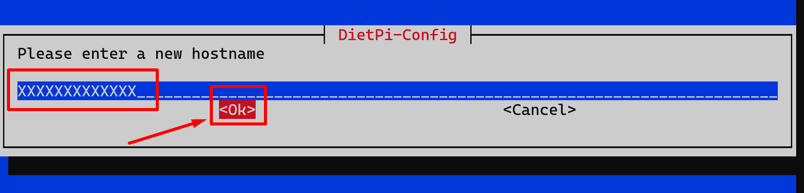

# mountainpi

#### User documentation for Silke Com for Mountain Top Pi.
Each Mountain Top Raspberry Pi is a V3 Raspberry Pi with an RTL-SDR dognle attached.  The Mountain Top RPi OS build also includes a web based DVR interface with motion detection designed to use inexpensive USB web cameras.  It also includes a web based GPIO (General Purpose Input Output) page for toggleing GPIOs states to +3V or 0V.  The project was lead by the Cat Lord Andy Record, with all devlopment by Oran Collins.

# Set Raspberry pi's Hostname
### login to pi

### run `dietpi-config`


### change the hostname to what you want.
#### to hit 'OK' press `TAB` once then `enter`

 
-----

# Set Raspberry pi's password
### login to pi

### run `dietpi-config`


### enter you password , to hit 'OK' press `TAB` once then `enter` once

 
-----

# How to set IP address
### login to pi

### run `dietpi-config`


### change the ip address

### example:


### Done!
 
-----

# 

# How to connect to web based SDR 

### SDR Software:

* Install basic SDR# software: https://airspy.com/download/  
* Read this tutorial:      https://airspy.com/quickstart/  
* Connect your SDR# application to http://192.168.2.72:1234  
* Remember, only one person can login to a site at any time.  The SDR# software will hang if someone else is connected to the device.

# How to connect to web based camera system  
### Camera System: 

* http://192.168.2.72:8765/
     * admin
     * spainFLOWER96@@

### If you set up motion detection, use email with the following SMTP info:
* Email addresses; mike@silkecom.com, Andre@silkecom.com, & others
* SMTP Server: xxxxxx
* SMTP port: xxxxx
* SMTP Account: xxxx
* SMTP Password: XXX
* From Address: site_name.rpicamera@silkecom.com
* Attached Pictures Time Span: “5”

# How to connect to and toggle GPIOs

### Turn GPIOs on and off
* http://192.168.2.72:8000/app/gpio-header
     * ###### username 
     > `silkecom`
     *  ###### password 
     > `&57wavesHUMAN`

* GPIO Info: https://www.raspberrypi.org/documentation/usage/gpio/
* How to drive a relay: https://projects-raspberry.com/raspberry-pi-driving-a-relay-using-gpio/


-----------
# Sys admin guide
## TODO

# License
```bash
MIT Copyright (c) 2021 zebadoba
```