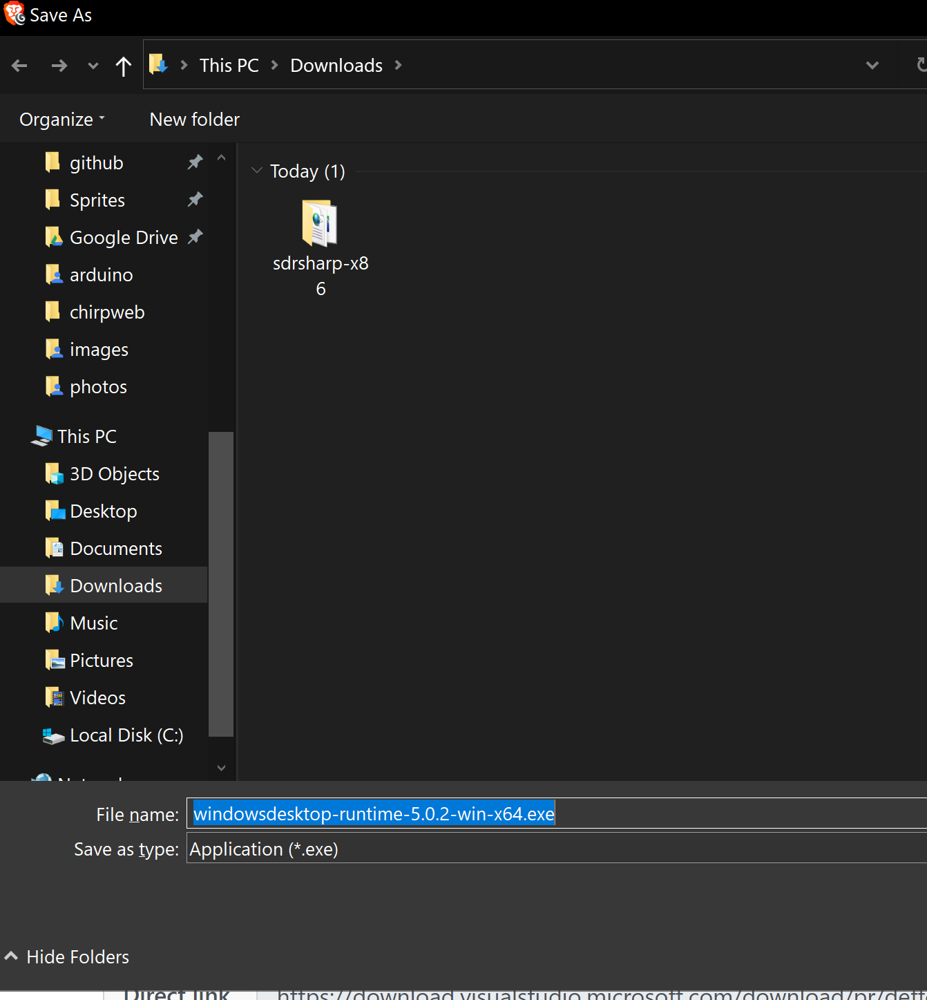
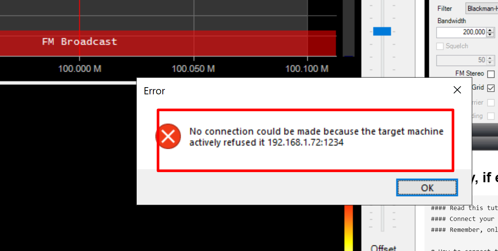

# mountainpi

#### User documentation for Silke Com for Mountain Top Pi.
Each Mountain Top Raspberry Pi is a V3 Raspberry Pi with an RTL-SDR dognle attached.  The Mountain Top RPi OS build also includes a web based DVR interface with motion detection designed to use inexpensive USB web cameras.  It also includes a web based GPIO (General Purpose Input Output) page for toggleing GPIOs states to 0V or +5v.  The project was lead by the 😼Cat Lord Andy Record, with all development by 👨‍💻 Oran Collins <[wisehackermonkey](https://www.github.com/wisehackermonkey)>.

# Quick start:
### - [Connect Radio](#how-to-connect-to-web-based-sdr)
### - [View Webcam](#how-to-connect-to-web-based-camera-system)
### - [Toggle Raspberry pi pins (GPIO)](#how-to-connect-to-and-toggle-gpios)
## Admin Guilds
### - [Change Hostname](#set-raspberry-pis-hostname)
### - [Change IP Address](#how-to-set-ip-address)
### - [Change webiopi password](#how-to-set-webiopi-password)
### - [Change Default RPI's password](#set-raspberry-pis-password)
### - [Change webcam password](###how-to-change-the-default-password)
### - [Advanced](#advanced)

# [DOWNLOAD RPI Image here](https://mega.nz/file/kE1nFCqJ#GcHeHwa-VjEAzYPnRlEISpjaMustKIwGJkCFJIEr_1M) valid as of (20210206)
# How to connect to web based SDR 

### SDR Software:
#### Install basic SDR# software: https://airspy.com/download/  
#### Read this tutorial:      https://airspy.com/quickstart/  


------

### Extract and open `SDRSharp.exe`





#### Almost finished!


#### Set host to raspberry pi's ip address XXX.XXX.XXX.XXX for my network its 192.168.1.72
### Ip address = `192.168.1.72`
### Port = `1234`
### Sample rate = `0.25 MSPS`

### Hit play, if everything was setup correctly you should hear radio static!
### Success!


### Trouble shooting
#### If you get an error like this one, 
- check that the pi is running and on the same network
- the port is correct
- the ip address to the pi is valid and correct 
     `ping 192.168.1.72` or `ssh root@192.168.1.72` to test if its up
- restart sdr sharp
- check wifi/local system connectivity
- Remember, only one person can login to a site at any time.  The SDR# software will hang if someone else is connected to the device.
- NOTE: `sdr-sharp` often crashes if you dont hit `stop` before quitting as a habit always click stop before exiting 


     -----------------
<br>
<br>
<br>

# How to connect to web based camera system  
### Camera System (motionEye): 

 
#### IP address + Port number 
#### Note: the  "192.168.2.72' will be different for each network.
<!-- ```bash -->
## http://XXX.XXX.XXX.XXX:8765
<!-- ``` -->
#### Example 
```bash
http://192.168.2.72:8765/

```


### Default admin account 
#### Username
```bash
admin
```
#### Password
```bash
spainFLOWER96@@
```
### Default user account (cant make changes to cameras)
#### Username
```bash
silkecom
```
#### Password (note the * are included)
```bash
enterSATURN35**
```
### How to change the default password


#### Note: "back up" before you make changes.

### If you set up motion detection, use email with the following SMTP info:
* Email addresses; mike@silkecom.com, Andre@silkecom.com, & others
* SMTP Server: xxxxxx
* SMTP port: xxxxx
* SMTP Account: xxxx
* SMTP Password: XXX
* From Address: site_name.rpicamera@silkecom.com
* Attached Pictures Time Span: “5”


<br>
<br>
------------------
<br>
<br>

# How to connect to and toggle GPIOs

### Turn GPIOs on and off


### http://192.168.2.72:8000/app/gpio-header
* ###### username 
> `silkecom`
*  ###### password 
> `&57wavesHUMAN`


### `OUT` = gpio pin is `ON`, and `IN` = gpio pin if `OFF`

### Reference
* GPIO Info: https://www.raspberrypi.org/documentation/usage/gpio/
* How to drive a relay: https://projects-raspberry.com/raspberry-pi-driving-a-relay-using-gpio/

<br>
<br>
------------------
<br>
<br>
# Sys admin guide

# Set Raspberry pis Hostname
### login to pi

### run `dietpi-config`


### change the hostname to what you want.
#### to hit 'OK' press `TAB` once then `enter`

 
-----

# Set Raspberry pis password
### login to pi
#### Default password OS
```text
4orderTERMS%%
```

### run `dietpi-config`


### enter you password , to hit 'OK' press `TAB` once then `enter` once

 
-----

# How to set IP address
### login to pi
#### Default password OS
```text
4orderTERMS%%
```

### run `dietpi-config`


### change the ip address

### example:


### Done!
 
# How to set webiopi password
###  type in to rpi bash `webiopi-passwd`


-----
# Advanced 
# How to stop/start webiopi
```bash
service webiopi start
service webiopi stop
service webiopi status
service webiopi restart

#  or alternatively
systemctl start webiopi
systemctl stop webiopi
```
### Advanced: edit the system service 
```bash
location of service
/etc/systemd/system/webiopi.service
```
#### example [ source link: webiopi.service](https://raw.githubusercontent.com/doublebind/raspi/master/webiopi.service)
```bash
[Unit]
Description = WebIOPi
After = syslog.target network.target

[Service]
Type = simple
WorkingDirectory = /usr/share/webiopi/htdocs
ExecStart = /usr/bin/python3 -m webiopi -l /var/log/webiopi -c /etc/webiopi/config

[Install]
WantedBy = multi-user.target
```
### Fix issues with RTL-sdr server (pi side) not working
#### Stop, Restart and build
##### Clone docker-compose file 
```bash
git clone https://github.com/zebadoba/mountainpi.git
cd mountainpi
```
##### or create one from scratch
```bash
nano docker-compose.yml

-----docker-compose.yml------
version: '3.3'
services:
    rtl-tcp:
        privileged: true
        devices:
            - /dev/ttyAMA0
        container_name: RTL-TCP
        ports:
            - '1234:1234'
        restart: always
        image: 'kosdk/rtl-tcp:latest'

-----end------
Press ctrl +x ,then 'y', then 
enter
```
##### stop
```bash
docker rm -f RTL-TCP
docker-compose down --remove-orphans
```

##### Start/Re-Start
```bash
docker-compose up -d
``` 
# Development by [wisehackermonkey](https://www.github.com/wisehackermonkey) 20210206

# License
# `MIT Copyright (c) 2021 zebadoba`